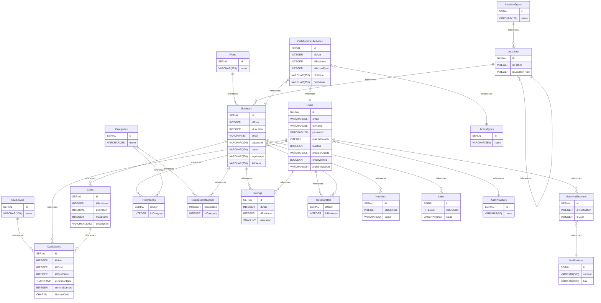

# Acumulapp DataBase documentation

## Summary

- [Introduction](#introduction)
- [Database Type](#database-type)
- [Table Structure](#table-structure)
  - [Users](#users)
  - [Cards](#cards)
  - [Business](#business)
  - [Locations](#locations)
  - [Categories](#categories)
  - [Links](#links)
  - [Numbers](#numbers)
  - [Ratings](#ratings)
  - [Plans](#plans)
  - [CardStates](#cardstates)
  - [Preferences](#preferences)
  - [Notifications](#notifications)
  - [CardsUsers](#cardsusers)
  - [UsersNotifications](#usersnotifications)
  - [Collaborators](#collaborators)
  - [LocationTypes](#locationtypes)
  - [BusinessCategories](#businesscategories)
  - [CollaboratorsActivities](#collaboratorsactivities)
  - [ActionTypes](#actiontypes)
  - [AuthProviders](#authproviders)
- [Relationships](#relationships)
- [Database Diagram](#database-diagram)

## Introduction

## Database type

- **Database system:** PostgreSQL

## Table structure

### Users

| Name                | Type         | Settings                 | References                                                                                                                  | Note                                                                                                  |
| ------------------- | ------------ | ------------------------ | --------------------------------------------------------------------------------------------------------------------------- | ----------------------------------------------------------------------------------------------------- |
| **id**              | SERIAL       | 🔑 PK, not null, unique  | fk_Users_id_UsersNotifications,fk_Users_id_CardsUsers,fk_Users_id_Preferences,fk_Users_id_Ratings,fk_Users_id_Collaborators |                                                                                                       |
| **email**           | VARCHAR(255) | not null                 |                                                                                                                             |                                                                                                       |
| **fullName**        | VARCHAR(255) | not null                 |                                                                                                                             |                                                                                                       |
| **password**        | VARCHAR(100) | null                     |                                                                                                                             |                                                                                                       |
| **idAuthProvider**  | INTEGER      | not null                 | fk_Users_idAuthProvider_AuthProviders                                                                                       |                                                                                                       |
| **isActive**        | BOOLEAN      | not null                 |                                                                                                                             |                                                                                                       |
| **providerUserId**  | VARCHAR(255) | null, unique             |                                                                                                                             | Almacena el ID único que el proveedor de autenticación (Google, Facebook, etc.) asigna a cada usuario |
| **emailVerified**   | BOOLEAN      | not null, default: FALSE |                                                                                                                             | Indica si la dirección de correo electrónico del usuario ha sido verificada                           |
| **profileImageUrl** | VARCHAR(500) | null                     |                                                                                                                             |                                                                                                       |

### Cards

| Name            | Type          | Settings                | References             | Note |
| --------------- | ------------- | ----------------------- | ---------------------- | ---- |
| **id**          | SERIAL        | 🔑 PK, not null, unique | fk_Cards_id_CardsUsers |      |
| **idBusiness**  | INTEGER       | not null                |                        |      |
| **expiration**  | INTERVAL      | not null                |                        |      |
| **maxStamp**    | INTEGER       | not null                |                        |      |
| **description** | VARCHAR(2000) | not null                |                        |      |

### Business

| Name           | Type         | Settings                | References                                                                                                                                             | Note |
| -------------- | ------------ | ----------------------- | ------------------------------------------------------------------------------------------------------------------------------------------------------ | ---- |
| **id**         | SERIAL       | 🔑 PK, not null, unique | fk_Business_id_BusinessCategories,fk_Business_id_Ratings,fk_Business_id_Collaborators,fk_Business_id_Numbers,fk_Business_id_Links,fk_Business_id_Cards |      |
| **idPlan**     | INTEGER      | not null                |                                                                                                                                                        |      |
| **idLocation** | INTEGER      | not null                |                                                                                                                                                        |      |
| **email**      | VARCHAR(80)  | not null                |                                                                                                                                                        |      |
| **password**   | VARCHAR(100) | not null                |                                                                                                                                                        |      |
| **name**       | VARCHAR(100) | not null                |                                                                                                                                                        |      |
| **logoImage**  | VARCHAR(500) | null                    |                                                                                                                                                        |      |
| **Address**    | VARCHAR(250) | null                    |                                                                                                                                                        |      |

### Locations

| Name               | Type    | Settings                | References                      | Note |
| ------------------ | ------- | ----------------------- | ------------------------------- | ---- |
| **id**             | SERIAL  | 🔑 PK, not null, unique | fk_Locations_id_Business        |      |
| **idFather**       | INTEGER | not null                | fk_Locations_idFather_Locations |      |
| **idLocationType** | INTEGER | not null                |                                 |      |

### Categories

| Name     | Type         | Settings                | References                                                       | Note |
| -------- | ------------ | ----------------------- | ---------------------------------------------------------------- | ---- |
| **id**   | SERIAL       | 🔑 PK, not null, unique | fk_Categories_id_Preferences,fk_Categories_id_BusinessCategories |      |
| **name** | VARCHAR(255) | not null                |                                                                  |      |

### Links

| Name           | Type         | Settings                | References | Note |
| -------------- | ------------ | ----------------------- | ---------- | ---- |
| **id**         | SERIAL       | 🔑 PK, not null, unique |            |      |
| **idBusiness** | INTEGER      | not null                |            |      |
| **value**      | VARCHAR(500) | not null                |            |      |

### Numbers

| Name           | Type        | Settings                | References | Note |
| -------------- | ----------- | ----------------------- | ---------- | ---- |
| **id**         | SERIAL      | 🔑 PK, not null, unique |            |      |
| **idBusiness** | INTEGER     | not null                |            |      |
| **value**      | VARCHAR(20) | not null                |            |      |

### Ratings

| Name           | Type     | Settings                | References | Note |
| -------------- | -------- | ----------------------- | ---------- | ---- |
| **id**         | SERIAL   | 🔑 PK, not null, unique |            |      |
| **idUser**     | INTEGER  | not null                |            |      |
| **idBusiness** | INTEGER  | not null                |            |      |
| **valoration** | SMALLINT | not null, default: 5    |            |      |

### Plans

| Name     | Type         | Settings                | References           | Note |
| -------- | ------------ | ----------------------- | -------------------- | ---- |
| **id**   | SERIAL       | 🔑 PK, not null, unique | fk_Plans_id_Business |      |
| **name** | VARCHAR(255) | not null                |                      |      |

### CardStates

| Name     | Type         | Settings                | References                  | Note |
| -------- | ------------ | ----------------------- | --------------------------- | ---- |
| **id**   | SERIAL       | 🔑 PK, not null, unique | fk_CardStates_id_CardsUsers |      |
| **name** | VARCHAR(100) | not null                |                             |      |

### Preferences

| Name           | Type    | Settings        | References | Note |
| -------------- | ------- | --------------- | ---------- | ---- |
| **idUser**     | SERIAL  | 🔑 PK, not null |            |      |
| **idCategory** | INTEGER | 🔑 PK, not null |            |      |

### Notifications

| Name        | Type         | Settings                | References | Note |
| ----------- | ------------ | ----------------------- | ---------- | ---- |
| **id**      | SERIAL       | 🔑 PK, not null, unique |            |      |
| **content** | VARCHAR(500) | not null                |            |      |
| **link**    | VARCHAR(500) | null                    |            |      |

### CardsUsers

| Name               | Type      | Settings                | References | Note |
| ------------------ | --------- | ----------------------- | ---------- | ---- |
| **id**             | SERIAL    | 🔑 PK, not null, unique |            |      |
| **idUser**         | INTEGER   | not null                |            |      |
| **idCard**         | INTEGER   | not null                |            |      |
| **idCardState**    | INTEGER   | not null                |            |      |
| **expirationDate** | TIMESTAMP | not null                |            |      |
| **currentStamps**  | INTEGER   | not null                |            |      |
| **UniqueCode**     | CHAR(8)   | null                    |            |      |

### UsersNotifications

| Name               | Type    | Settings                | References                                         | Note |
| ------------------ | ------- | ----------------------- | -------------------------------------------------- | ---- |
| **id**             | SERIAL  | 🔑 PK, not null, unique |                                                    |      |
| **idNotification** | INTEGER | not null                | fk_UsersNotifications_idNotification_Notifications |      |
| **idUser**         | INTEGER | not null                |                                                    |      |

### Collaborators

| Name           | Type    | Settings        | References | Note |
| -------------- | ------- | --------------- | ---------- | ---- |
| **idUser**     | SERIAL  | 🔑 PK, not null |            |      |
| **idBusiness** | INTEGER | 🔑 PK, not null |            |      |

### LocationTypes

| Name     | Type         | Settings                | References                    | Note |
| -------- | ------------ | ----------------------- | ----------------------------- | ---- |
| **id**   | SERIAL       | 🔑 PK, not null, unique | fk_LocationTypes_id_Locations |      |
| **name** | VARCHAR(150) | not null                |                               |      |

### BusinessCategories

| Name           | Type    | Settings        | References | Note |
| -------------- | ------- | --------------- | ---------- | ---- |
| **idBusiness** | INTEGER | 🔑 PK, not null |            |      |
| **idCategory** | INTEGER | 🔑 PK, not null |            |      |

### CollaboratorsActivities

| Name             | Type         | Settings                | References                                          | Note |
| ---------------- | ------------ | ----------------------- | --------------------------------------------------- | ---- |
| **id**           | SERIAL       | 🔑 PK, not null, unique |                                                     |      |
| **idUser**       | INTEGER      | not null                | fk_CollaboratorsActivities_IdUser_Users             |      |
| **idBusiness**   | INTEGER      | not null                | fk_CollaboratorsActivities_idBusiness_Business      |      |
| **idActionType** | INTEGER      | not null                | fk_CollaboratorsActivities_idActionType_ActionTypes |      |
| **oldValue**     | VARCHAR(255) | null                    |                                                     |      |
| **newValue**     | VARCHAR(255) | null                    |                                                     |      |

### ActionTypes

| Name     | Type         | Settings                | References | Note |
| -------- | ------------ | ----------------------- | ---------- | ---- |
| **id**   | SERIAL       | 🔑 PK, not null, unique |            |      |
| **name** | VARCHAR(255) | not null                |            |      |

### AuthProviders

| Name     | Type        | Settings                | References | Note |
| -------- | ----------- | ----------------------- | ---------- | ---- |
| **id**   | SERIAL      | 🔑 PK, not null, unique |            |      |
| **name** | VARCHAR(50) | not null                |            |      |

## Relationships

- **UsersNotifications to Notifications**: many_to_one
- **Users to UsersNotifications**: one_to_many
- **CardStates to CardsUsers**: one_to_many
- **Users to CardsUsers**: one_to_many
- **Cards to CardsUsers**: one_to_many
- **Users to Preferences**: one_to_many
- **Categories to Preferences**: one_to_many
- **Categories to BusinessCategories**: one_to_many
- **Business to BusinessCategories**: one_to_many
- **Business to Ratings**: one_to_many
- **Users to Ratings**: one_to_many
- **Users to Collaborators**: one_to_many
- **Business to Collaborators**: one_to_many
- **Business to Numbers**: one_to_many
- **Plans to Business**: one_to_many
- **LocationTypes to Locations**: one_to_many
- **Locations to Locations**: many_to_one
- **Locations to Business**: one_to_many
- **Business to Links**: one_to_many
- **Business to Cards**: one_to_many
- **CollaboratorsActivities to Users**: many_to_one
- **CollaboratorsActivities to Business**: many_to_one
- **CollaboratorsActivities to ActionTypes**: many_to_one
- **Users to AuthProviders**: many_to_one

## Database Diagram

